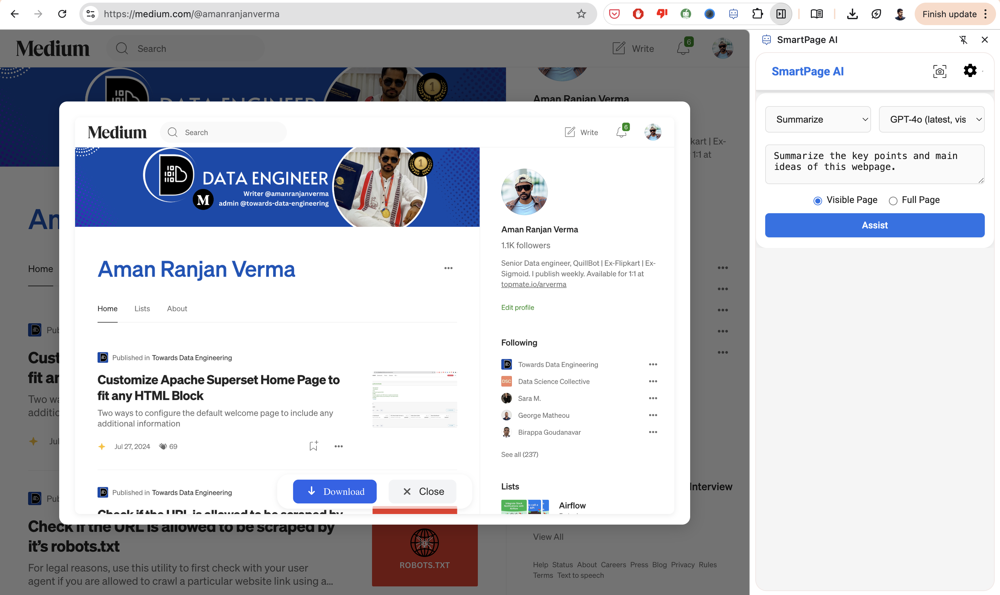
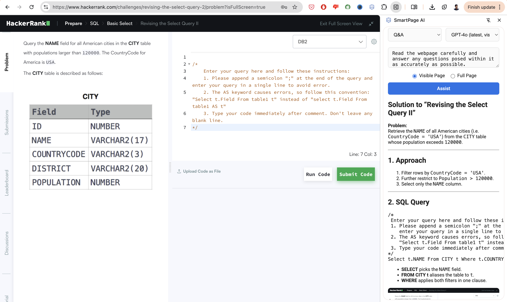
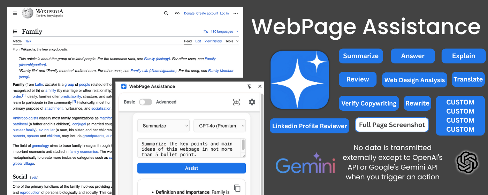

# 📖 WebPage Assistance (Chrome Extension)

WebPage Assistance is a modern Chrome extension that lets you analyze, summarize, translate, and get insights from any webpage using OpenAI's GPT models and Google's Gemini—with beautiful Markdown output and a polished, minimal UI.

---

## ✨ Features

- 📸 **Advanced Screenshot Analysis**
  - Capture full page or visible area screenshots
  - AI-powered analysis of webpage content and design
  - Download screenshots with a single click
  - Beautiful modal interface for viewing and managing captures
    

- 🧠 **Smart Analysis Options**
  - **Summarize**: Get concise overviews of webpage content
  - **Q&A**: Get accurate answers to questions about the page
  - **Translate**: Convert content to different languages (e.g., Hindi)
  - **Explain**: Break down complex concepts into simple terms
  - **Web Design Analysis**: Get detailed feedback on webpage design, including:
    - Design principles (colors, typography, layout)
    - UI/UX improvements
    - Accessibility recommendations
  - **Custom Prompts**: Write and save your own analysis prompts
    
    

- 🤖 **Advanced AI Integration**
  - Support for OpenAI's latest vision models
  - Integration with Google's Gemini for enhanced analysis
  - Real-time analysis with minimal latency
  - Robust error handling and user feedback

- 🖼️ **Enhanced Output**
  - Beautiful Markdown rendering for clear, structured responses
  - Support for code blocks, lists, and formatted text
  - Easy-to-read formatting with proper spacing and hierarchy

- 🛡️ **Privacy & Security**
  - Local storage of API keys and custom prompts
  - No data collection or external transmission
  - Secure handling of sensitive information

- 🧩 **Modern UI/UX**
  - Material Design-inspired interface
  - Responsive and accessible design
  - Intuitive controls and clear feedback
  - Dark mode support

---

## 🚀 Getting Started

1. **Install the Extension**
   - Clone this repository or download the latest release
   - Load it as an unpacked extension in Chrome

2. **Setup**
   - Get your OpenAI API key from [OpenAI Platform](https://platform.openai.com/docs/api-reference/introduction)
   - Get your Google API key for Gemini from [Google AI Studio](https://makersuite.google.com/app/apikey)
   - Add your API keys in the extension settings panel

3. **Using the Extension**
   - Click the extension icon to open the side panel
   - Choose your preferred analysis mode
   - Select screenshot type (Full Page or Visible Area)
   - Click "Assist" to start the analysis
   - View results in beautifully formatted Markdown

---

## 📝 Custom Prompt Examples

Here are some examples of custom prompts you can use:

### LinkedIn Profile Reviewer
```markdown
Review the LinkedIn Profile from the eye of a technical recruiter who is looking for a senior Data Engineer for L3 position. Score each section on the scale of 10 and suggest actionable improvements.
```

---

## 🛡️ Privacy

- Your API keys and custom prompts are stored **only on your local browser** using `chrome.storage.sync`
- No data is transmitted externally except to OpenAI's API or Google's Gemini API when you trigger an action
- All processing happens locally in your browser

---

## 🛠️ Developer Notes

- **Modular Architecture**
  - Clean separation of concerns with dedicated services
  - Centralized configuration in `src/constants/`
  - Reusable components and utilities

- **Easy to Extend**
  - Add default prompts in `src/constants/defaultPrompts.js`
  - Support for new models in `src/constants/models.js`
  - Well-documented code structure

- **Production Ready**
  - Optimized performance
  - Minimal logging
  - Comprehensive error handling
