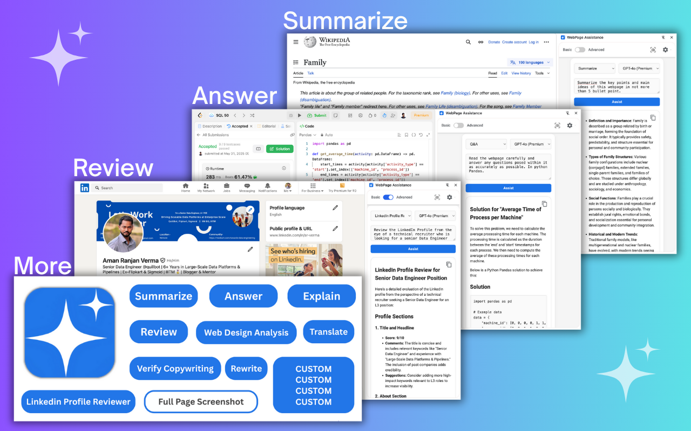
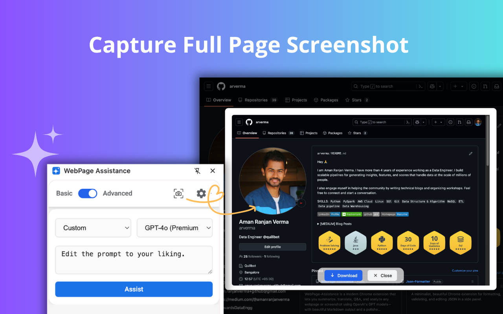
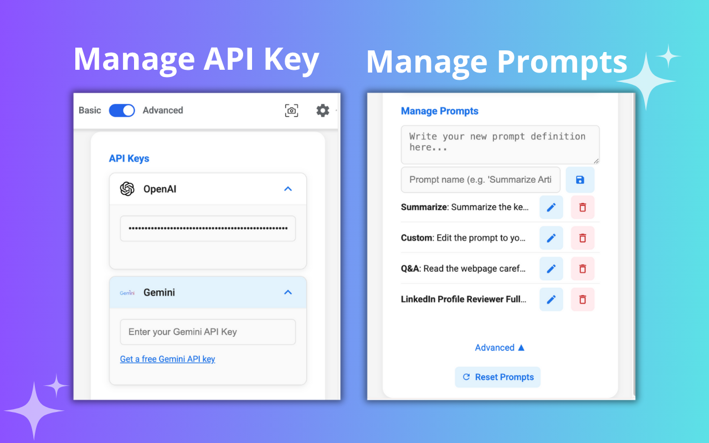
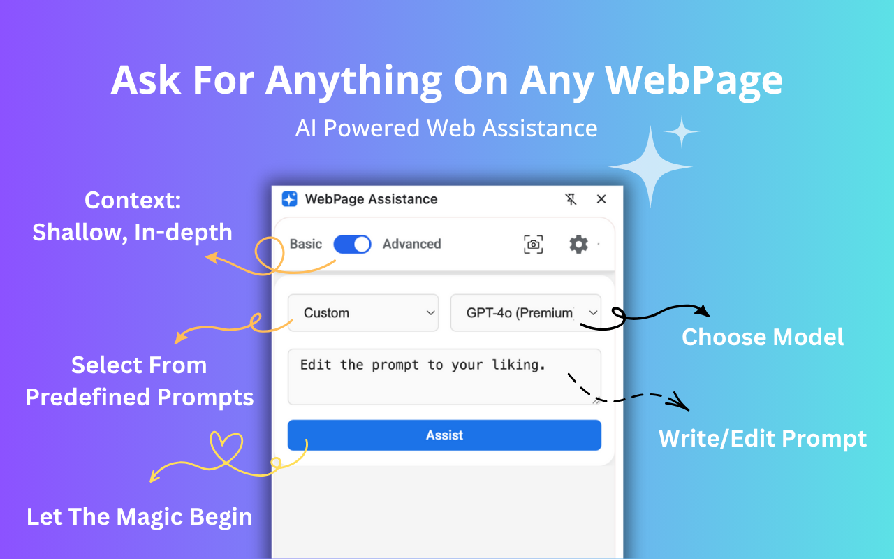

# 📖 WebPage Assistance (Chrome Extension)
**Ask For Anything On Any WebPage**
In an era where information is at your fingertips, WebPage Assistance ensures you make the most of every page. This AI-driven extension integrates seamlessly with your browser, offering real-time assistance for everything from summarizing articles to answering complex questions. Whether you're diving into detailed reports, exploring new topics, or refining professional emails, WebPage Assistance empowers you with clarity, speed, and efficiency.


<div align="center">
  
  
</div>

---

## Features

**Your Gateway to Enhanced Online Interaction**
**✨ Custom Prompts**
- Streamline your tasks and tailor your browsing experience with personalized prompts, perfect for both students and professionals.
- Simplify complex topics and automate content reviews.
- Create custom modes to match your daily needs.
<div align="center">
    
</div>

**📸 Full Page Screenshot**
- Capture the entire webpage with a single click and save it for your use.

**🤖 Powered by OpenAI & Gemini**
- Choose between the latest OpenAI and Google Gemini models for your analysis. Enjoy fast, accurate results for summary, Q&A, translation, and more—right inside your browser.

**⚡ Boost Productivity on Any Webpage**
- Whether you're studying, working, or just browsing, WebPage Assistance helps you extract value from every page. No more copy-pasting or switching tabs—just click assist, and go.

**🔒 Privacy First, Local Storage**
- Your API keys and custom prompts are stored only on your device. No tracking, no data collection by the publisher—just powerful AI at your fingertips. (Read OpenAI and Gemini data collection policies for their respective APIs.)

---

## 🚀 Getting Started

1. **Install the Extension**
   - Clone this repository or download the latest release
   - Load it as an unpacked extension in Chrome

2. **Setup**
   - Get your OpenAI API key from [OpenAI Platform](https://platform.openai.com/docs/api-reference/introduction)
   - Get your Google API key for Gemini from [Google AI Studio](https://makersuite.google.com/app/apikey)
   - Add your API keys in the extension settings panel
    

3. **Using the Extension**
   - Click the extension icon to open the side panel
    

1. **Custom Prompt Examples**
     - LinkedIn Profile Reviewer
         ```markdown
         Review the LinkedIn Profile from the eye of a technical recruiter who is looking for a senior Data Engineer for L3 position. Score each section on the scale of 10 and suggest actionable improvements.
         ```
     - LinkedIn Profile Reviewer
         ```markdown
         Review the LinkedIn Profile from the eye of a technical recruiter who is looking for a senior Data Engineer for L3 position. Score each section on the scale of 10 and suggest actionable improvements.
         ```

---

## 🛠️ Developer Notes

- **Modular Architecture**
  - Clean separation of concerns with dedicated services
  - Centralized configuration in `src/constants/`
  - Reusable components and utilities

- **Easy to Extend**
  - Add default prompts in `src/constants/defaultPrompts.js`
  - Support for new models in `src/constants/models.js`
  - Well-documented code structure

- **Production Ready**
  - Optimized performance
  - Minimal logging
  - Comprehensive error handling
