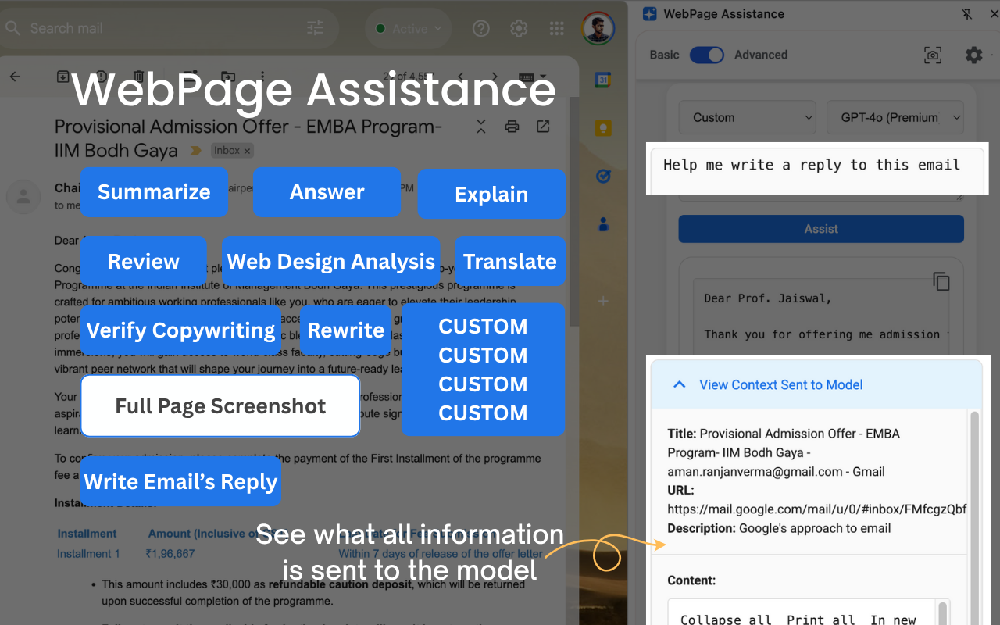

# 📖 WebPage Assistance (Chrome Extension)

**Ask For Anything On Any WebPage**  
In an era where information is at your fingertips, WebPage Assistance ensures you make the most of every page. This AI-driven extension integrates seamlessly with your browser, offering real-time assistance for everything from summarizing articles to answering complex questions. Whether you're diving into detailed reports, exploring new topics, or refining professional emails, WebPage Assistance empowers you with clarity, speed, and efficiency.

<div align="center">
  
  
</div>

---

## Features

**Your Gateway to Enhanced Online Interaction**


**✨ Custom Prompts**
- Streamline your tasks and tailor your browsing experience with personalized prompts, perfect for both students and professionals.
- Simplify complex topics and automate content reviews.
- Create custom modes to match your daily needs.
<div align="center">
    
</div>

**📸 Full Page Screenshot**
- Capture the entire webpage with a single click and save it for your use.

**🤖 Powered by OpenAI & Gemini**
- Choose between the latest OpenAI and Google Gemini models for your analysis. Enjoy fast, accurate results for summary, Q&A, translation, and more—right inside your browser.

**⚡ Boost Productivity on Any Webpage**
- Whether you're studying, working, or just browsing, WebPage Assistance helps you extract value from every page. No more copy-pasting or switching tabs—just click assist, and go.

**🔒 Privacy First, Local Storage**
- Your API keys and custom prompts are stored only on your device. No tracking, no data collection by the publisher—just powerful AI at your fingertips. (Read OpenAI and Gemini data collection policies for their respective APIs.)

---

## Custom Prompt Examples

- **Email Reply Generator**
    ```markdown
    Generate a professional and courteous reply to the email currently on my screen. Ensure the response addresses all key points mentioned and maintains a tone appropriate for business communication.
    ```
- **Meeting Summary Creator**
    ```markdown
    Create a concise summary of the meeting notes displayed on my screen. Highlight key decisions, action items, and next steps, ensuring clarity and completeness for all participants.
    ```
- **Task Organizer**
    ```markdown
    Organize the tasks listed on my screen into a prioritized to-do list. Assign deadlines based on urgency and importance, and suggest any additional steps needed to complete each task efficiently.
    ```
- **Social Media Post Crafter**
    ```markdown
    Craft a compelling social media post based on the content on my screen. Ensure it is engaging and tailored for the intended platform, including appropriate hashtags and a call-to-action.
    ```
- **Document Proofreader**
    ```markdown
    Proofread the document text displayed on my screen for grammar, spelling, and punctuation errors. Suggest improvements for clarity, tone, and style to enhance the overall readability and professionalism of the document.
    ```

---

## 🤝 Contributing

Contributions, suggestions, and new prompt ideas are welcome! If you have an idea for a new feature, prompt, or improvement, please open an issue or submit a pull request. See [CONTRIBUTING.md](CONTRIBUTING.md) for guidelines. We encourage both students and professionals to help make WebPage Assistance even better for everyone.

---

## Getting Started

1. **Install the Extension**
   - Clone this repository or download the latest release
   - Load it as an unpacked extension in Chrome
2. **Setup**
   - Get your OpenAI API key from [OpenAI Platform](https://platform.openai.com/docs/api-reference/introduction)
   - Get your Google API key for Gemini from [Google AI Studio](https://makersuite.google.com/app/apikey)
   - Add your API keys in the extension settings panel
3. **Using the Extension**
   - Click the extension icon to open the side panel
   - Choose your preferred analysis mode
   - Select screenshot type (Full Page or Visible Area)
   - Click "Assist" to start the analysis
   - View results in beautifully formatted Markdown

<div align="center">
    
    
</div>

---

## Contact
For questions, support, or feedback, please visit the [support site](https://sites.google.com/view/arverma/webpage-assistance?authuser=0).
